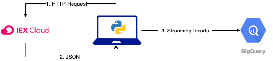
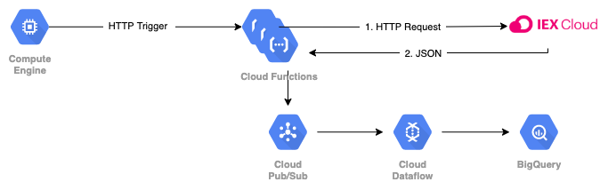
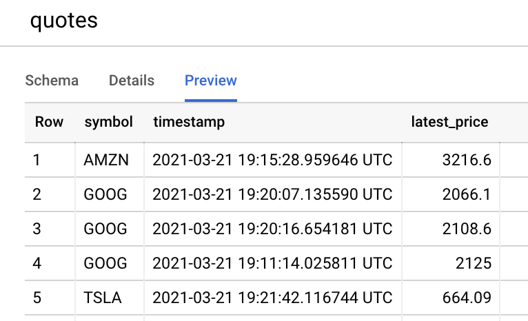
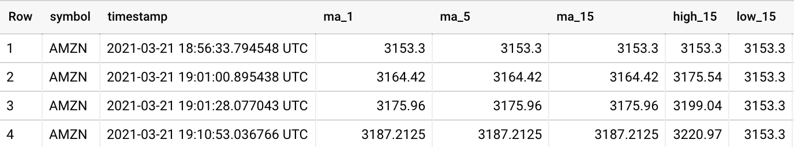

# Jumping Gravity
Data Engineering assessment for nPlan.


### Current Architecture



### Future Architecture



#### Setup


##### Create .env file in project root and set the following variables
```
PUBLISHABLE_TOKEN=[IEX_PUBLISHABLE_TOKEN]
PROJECT_ID=[GCP_PROJECT_ID]
GOOGLE_APPLICATION_CREDENTIALS=[GOOGLE_APPLICATION_CREDENTIALS]
```

##### Service Account
- Put service account file `service_account.json` with write access to your BigQuery dataset.


##### Start streaming data into BigQuery
```
git clone https://github.com/sabih-h/jumping-gravity.git
cd jumping-gravity
python main.py
```

##### Quotes Table
- Data streams into this table.




##### Aggregate View
```
SELECT * FROM `deep-q.stocks.quote_aggregates`
```




This view has the following query:
```
SELECT symbol
  , timestamp
  , AVG(latest_price) OVER (PARTITION BY symbol ORDER BY timestamp ASC ROWS BETWEEN 5 PRECEDING AND CURRENT ROW) AS ma_1  # 1 minute moving average
  , AVG(latest_price) OVER (PARTITION BY symbol ORDER BY timestamp ASC ROWS BETWEEN 29 PRECEDING AND CURRENT ROW) AS ma_5  # 5 minute moving average
  , AVG(latest_price) OVER (PARTITION BY symbol ORDER BY timestamp ASC ROWS BETWEEN 89 PRECEDING AND CURRENT ROW) AS ma_15  # 15 minute moving average
  
  , MAX(latest_price) OVER (PARTITION BY symbol ORDER BY timestamp ASC ROWS BETWEEN 89 PRECEDING AND CURRENT ROW) AS high_15  # 15 minute High
  , MIN(latest_price) OVER (PARTITION BY symbol ORDER BY timestamp ASC ROWS BETWEEN 89 PRECEDING AND CURRENT ROW) AS low_15  # 15 minute Low
FROM
  `deep-q.stocks.quotes`
ORDER BY symbol, timestamp

```


##### Python Version
- Tested on python version 3.7.9


